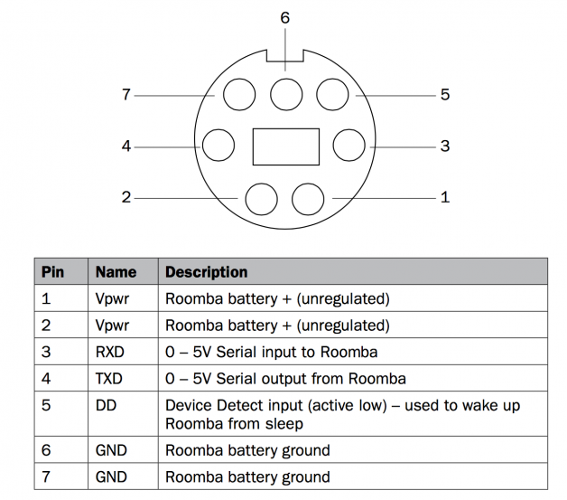
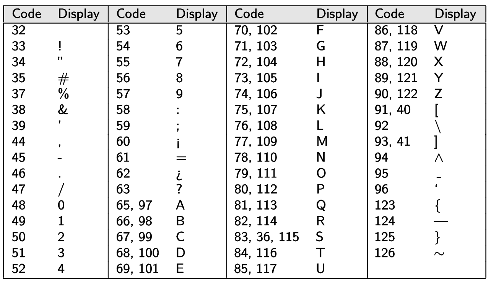
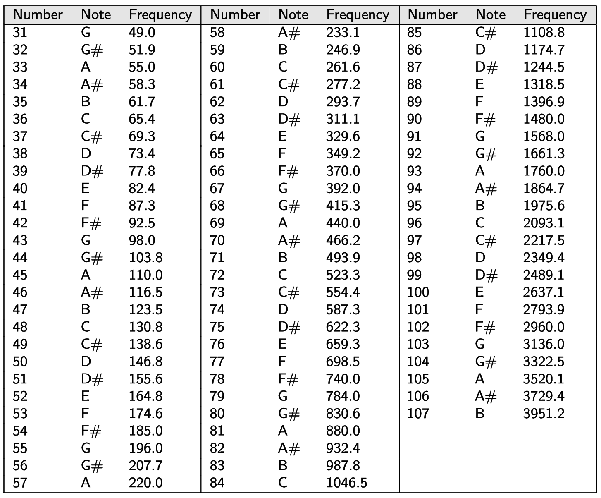
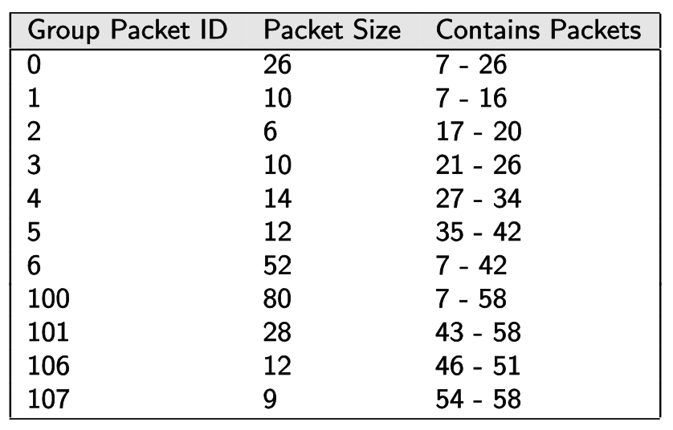
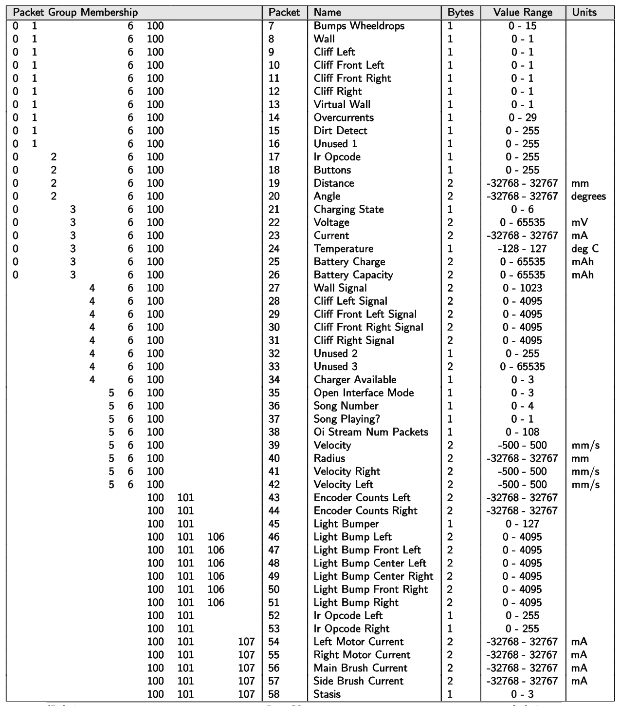

# API

Some clarification on the Roomba Open Interface and this library.

## Implemented OI codes

Not everything is implemented. Eventually, I will put some documentation here, but right now it is probably easier to just read the code or look at the examples.

- Start
- Reset
- Stop
- Safe
- Full
- Seek Dock
- Power
- Drive
- Digit LED ASCII
- Sensors
- Song
- Play
- Query List

# Useful Tables and Figures from the Manual

# More Mode Details

Note, these are copied from the manual.

## Passive Mode

Upon sending the Start command or any one of the cleaning mode commands (e.g.,
Spot, Clean, Seek Dock), the OI enters into Passive mode. When the OI is in
Passive mode, you can request and receive sensor data using any of the sensor
commands, but you cannot change the current command parameters for the actuators
(motors, speaker, lights, low side drivers, digital outputs) to something else.
To change how one of the actuators operates, you must switch from Passive mode
to Full mode or Safe mode.

While in Passive mode, you can read Roomba’s sensors, watch Roomba perform a
cleaning cycle, and charge the battery.

In Passive mode, Roomba will go into power saving mode to conserve battery
power after five minutes of inactivity. To disable sleep, pulse the BRC pin low
periodically before these five minutes expire. Each pulse resets this five
minute counter. (One example that would not cause the baud rate to inadvertently
change is to pulse the pin low for one second, every minute, but there are other
periods and duty cycles that would work, as well.)

## Safe Mode

When you send a Safe command to the OI, Roomba enters into Safe mode. Safe mode
gives you full control of Roomba, with the exception of the following safety-related
conditions:

- Detection of a cliff while moving forward (or moving backward with a small turning radius, less than one robot radius)
- Detection of a wheel drop (on any wheel)
- Charger plugged in and powered

Should one of the above safety-related conditions occur while the OI is in Safe
mode, Roomba stops all motors and reverts to the Passive mode.

If no commands are sent to the OI when in Safe mode, Roomba waits with all motors
and LEDs off and does not respond to button presses or other sensor input.

Note that charging terminates when you enter Safe Mode, and Roomba will not power
save.

## Full Mode

When you send a Full command to the OI, Roomba enters into Full mode. Full mode
gives you complete control over Roomba, all of its actuators, and all of the
safety-related conditions that are restricted when the OI is in Safe mode, as
Full mode shuts off the cliff, wheel-drop and internal charger safety features.
To put the OI back into Safe mode, you must send the Safe command.

If no commands are sent to the OI when in Full mode, Roomba waits with all motors
and LEDs off and does not respond to button presses or other sensor input.

Note that charging terminates when you enter Full Mode, and Roomba will not power
save.

# Encoders

From the manual.

**NOTE:** These encoders are square wave, not quadrature, so they rely on the
robot’s commanded velocity direction to know when to count up/down. So if the
robot is trying to drive forward, and you force the wheels to spin in reverse,
the encoders will count up, (and vice-versa). Additionally, the encoders will
count up when the commanded velocity is zero and the wheels spin.

To convert counts to distance, simply do a unit conversion using the equation
for circle circumference.

- N counts * (mm in 1 wheel revolution / counts in 1 wheel revolution) = mm
- N counts * (pi * 72.0 / 508.8) = mm

# Issues

There are numerous issues with the Create 2, like the version before it.

- the encoders aren't that great
- why are they using a DIN-7 for the interface, what is this ... the 80's? Ok, maybe in the 90's when this all started that was fine, but it is many decades later ... do they have stock in DIN connectors?
- there is no power available for an arduino or raspberry pi from the provided USB cable, you have to make your own and some people have reported it didn't work. It is just easier, probably, to get another battery to power your processor
- the song function is finicky and doesn't always work right
- roomba can become confused and the only way to reset it is to unscrew the base plate and pull the battery ... great job geniuses!!
- the robot seems to refuse to report its current mode (response to packet 35) ... I never get a response
- Why didn't iRobot drill the hole for the serial port (DIN-7) for us? It is labelled as a programming robot and the only way to program it is through that hole. I guess it was either paint the cover green or give us a useful item out of the box.
- there are numerous reports that the USB cable is wired wrong, so trying to wake the roomba by toggling the BRC pin (RTS on serial) doesn't work. I think I got it to work once on my roomba, but it is not repeatable or reliable.
- basically the firmware of the roomba is shit, closed source, and full of vacuum functions that shouldn't be there anymore. I know it is basically a reconditioned vacuum, but a separate firmware (open source maybe) would be great to fix all the ills of the robot. Also, I can't find anyway to update the firmware either ... there is probably some super painful way to do it, but I haven't found it yet.
    - I think some intern wrote this mess of a firmware
- basically, iRobot is just trying to make more money by pushing old crap, but there aren't a lot of good alternatives ... yes I am am ranting.

## macOS

Apple's [USB-A-to-C](https://www.apple.com/shop/product/MJ1M2AM/A/usb-c-to-usb-adapter)
converter doesn't work with iRobot's USB-to-serial converter. I used a
[Monoprice USB-C Hub](https://www.amazon.com/gp/product/B019FN66IC/ref=oh_aui_detailpage_o03_s01?ie=UTF8&psc=1)
and it worked fine.
